# Thoth x.x. Used by [m][e] as template for some multi-platform Podcast Catcher app.

Thoth is a Xamarin Forms Rss Podcast Catcher

## Summary
Thoth is a project I used to learn Xamarin Forms.  It's a simple project that could be used for real.

## Screenshots
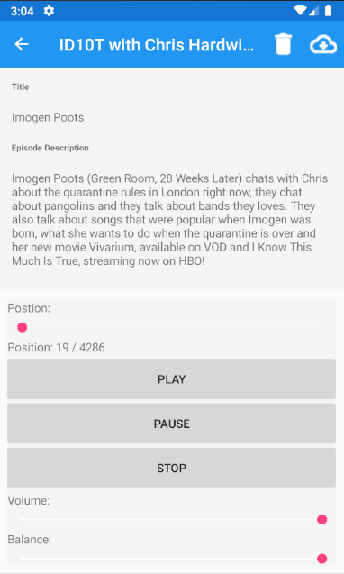
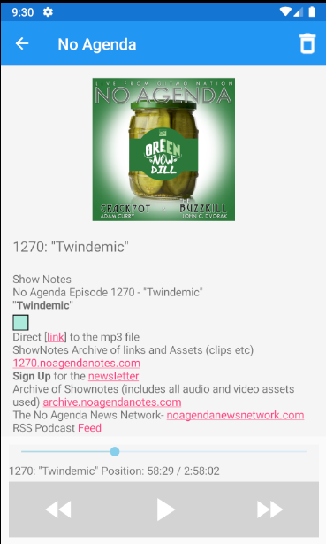
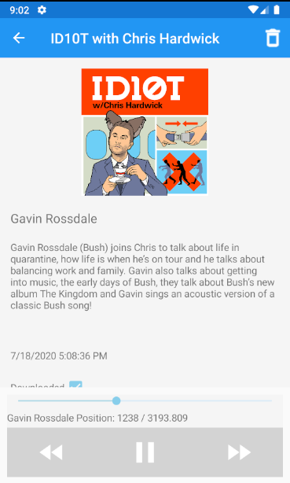
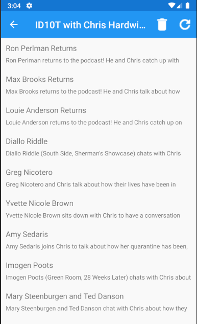
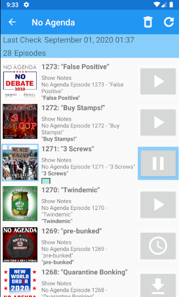
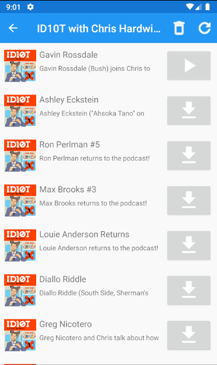
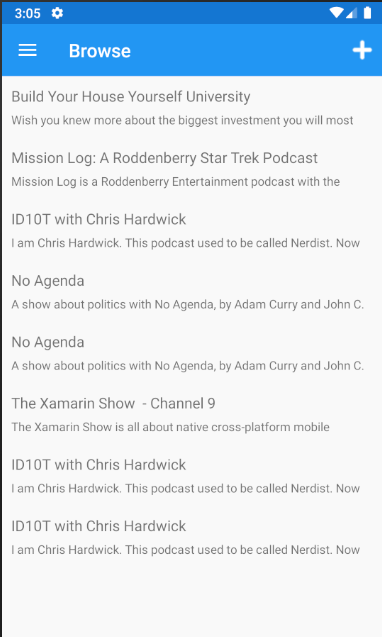
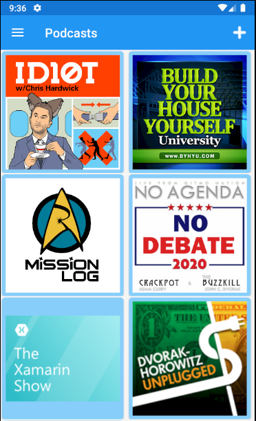
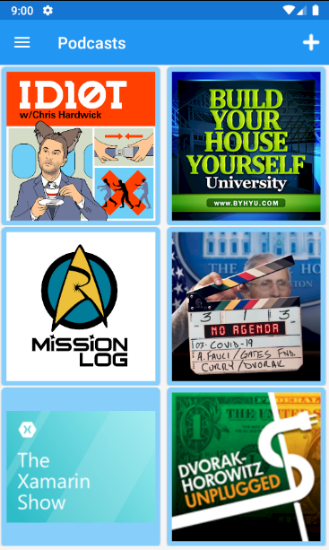
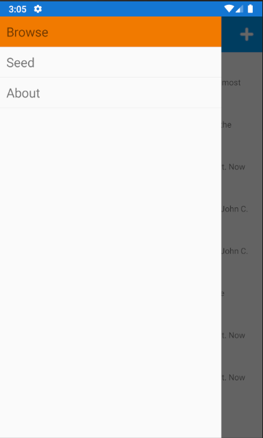
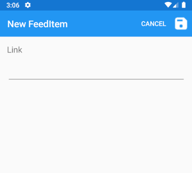
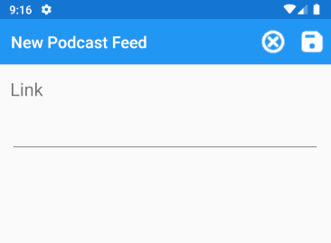
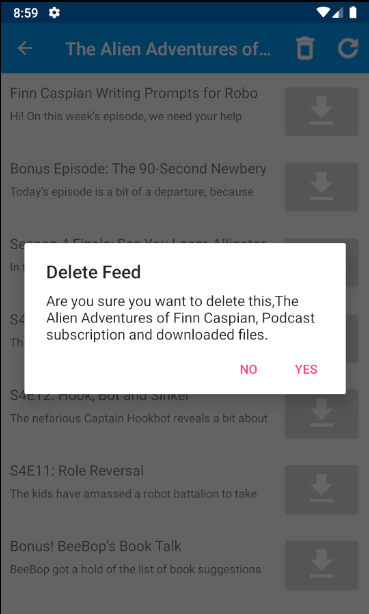

## Features 
* Download audio files on background thread
* Read RSS feeds
* Keep separate images for each episode
* Play 1 audio file at a time
* Play from episode list and details page
* Click on cover art from episode detail page to see full screen art
* Detect play ended event and broadcast
* Keep track of play position thru play/pause actions
* Download and delete specific episodes
* Add feed from url
* Play/Pause button on episode list indicates downloading and download queued
* Downloads are queued in the common code; images and podcasts are queued

## Target 
The Android side is developed against a Pixel 2 Pie and Nokia 5x Pie emulator.

## Architecture 
The design pattern for the UI is MVVM.  The code behinds are kept minimal, mostly to event binding and passing through to the ViewModels.  There's a single DataStore class for all objects.  Services are provided for the audio player and downloader.  A Entity Managers are used for actions around specific model classes.  For example, the FeedItemManager refreshes feeds and deletes feeds.
 
Downloads are done in Android specific project on a background thread.  Using the UI thread did not complete a podcast download successfully.

ViewModels are notified of Entity changes through MessagingCenter.  They subscribe to the message and check that the entity in it matches one in the current ViewModel and then update with the new Entity.  The RssEpisode entity sends and updates on DataStore save of this entity, which seems kind of odd.  Not sure if this is right or not. 
 
## TODO 
* Background download thread for UWP
* Unit Tests
* Share downloaded podcasts with other Thoths
* Images right?
* Test UWP
* Use external storage
* Settings page
* Periodic checking
* Polish UI
* Download images on background thread
* Show if play is completed
* Download Queue page showing active and queued downloads
* Play audio on background thread
* Show an icon on the system toolbar when background thread operations are happening

## Reference(s)
* https://github.com/ssorrrell/Thoth
* https://github.com/ssorrrell

## ..
As is. No support. RnD only.

## .
MediaExplorer June, 2023

